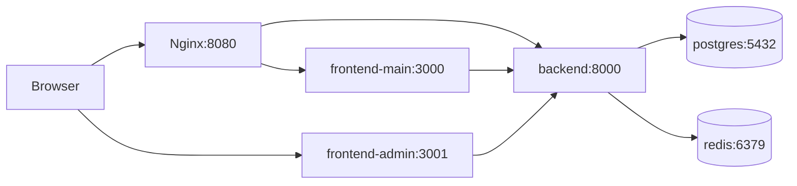

# Architecture

This starter is a **multi-container** system orchestrated by Docker Compose, with a **pnpm monorepo** for TypeScript frontends and a standalone Django backend.

## Components

### Backend (`apps/backend`)

- **Framework**: Django + Django REST Framework
- **Public API** (custom): `GET /api/health/`, `GET /api/hello/`
- **API errors**: JSON envelope with `success: false` and `error.code`, `error.message`, `error.details` (safe messages only; no stack traces)
- **Admin UI**: Django’s built-in admin at `/admin/` (no custom admin APIs)
- **Data**: PostgreSQL via `DATABASES`
- **Cache**: Redis via `django-redis` (`CACHES`)
- **Settings split**: `config.settings.{dev,test,prod}` selected by `DJANGO_SETTINGS_MODULE`

### Frontends

- **`apps/frontend-main`**: primary user-facing Next.js app.
- **`apps/frontend-admin`**: separate Next.js “admin shell” skeleton (not Django admin).

Both apps:

- Call the backend using shared helpers from `@starter/shared`
- Are built as **Next.js standalone** outputs in production images

### Shared package (`packages/shared`)

Workspace package `@starter/shared` provides:

- API helpers (`getHello`, `getJson`)
- UI primitives (`Button`, `LoadingState`, `ErrorState`)
- Hooks (`useApi`)
- Types and route constants

Exports are declared in `packages/shared/package.json` so imports are stable across local dev, Docker, and CI.

### PostgreSQL

Primary relational store for Django (sessions, admin, future models).

### Redis

Used as Django’s default cache backend (`django-redis`).

### Nginx

- **Dev/Debug**: HTTP reverse proxy on `:8080` routing `/`, `/api/`, `/static/`, and `/admin/` (Django admin). Next admin shell on `:3001/`.
- **Prod**: HTTPS-only routing by hostname (`starter.com`, `admin.starter.com`, `api.starter.com` in the sample config).

### Docker Compose environments

Compose stacks live under **`infra/docker/compose/`** (not the repo root). Scripts and the Makefile invoke:

`docker compose --project-directory <repo-root> -f infra/docker/compose/docker-compose.<stack>.yml …`

so paths inside YAML (`context: .`, `./apps/...`, `./infra/...`) stay root-relative.

| Compose file                                                                                        | Purpose                                                                           |
| --------------------------------------------------------------------------------------------------- | --------------------------------------------------------------------------------- |
| [`infra/docker/compose/docker-compose.dev.yml`](../infra/docker/compose/docker-compose.dev.yml)     | Hot reload + bind mounts                                                          |
| [`infra/docker/compose/docker-compose.debug.yml`](../infra/docker/compose/docker-compose.debug.yml) | Same as dev, but Django runs under **debugpy** (`5678`)                           |
| [`infra/docker/compose/docker-compose.test.yml`](../infra/docker/compose/docker-compose.test.yml)   | Postgres + Redis + **one-shot `test-runner`** image executing the full test suite |
| [`infra/docker/compose/docker-compose.prod.yml`](../infra/docker/compose/docker-compose.prod.yml)   | Non-dev services: Gunicorn + built Next apps + TLS-ready Nginx                    |

## Request flow (development)

## Intentional non-goals (for this skeleton)

- No authentication/authorization product features
- No JWT/OAuth/SSO
- No advanced observability platform wiring

Extend these in application code when requirements appear.
